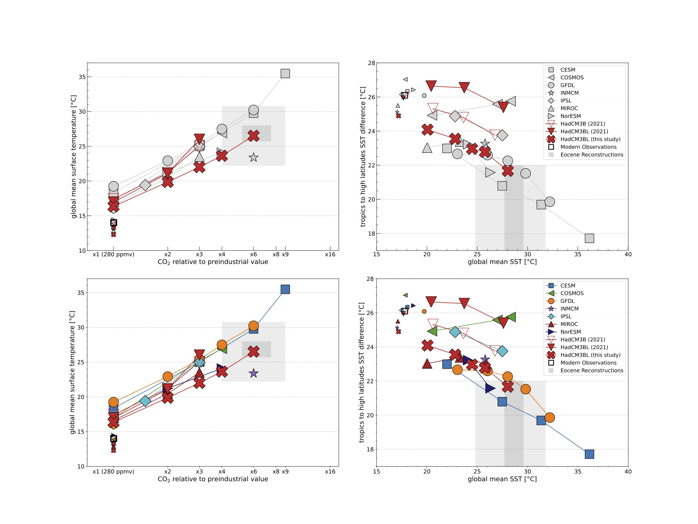
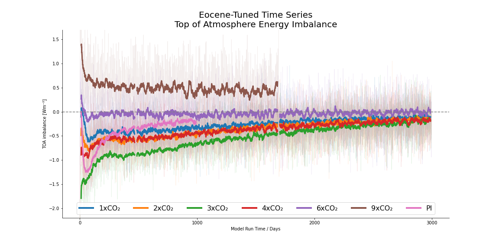
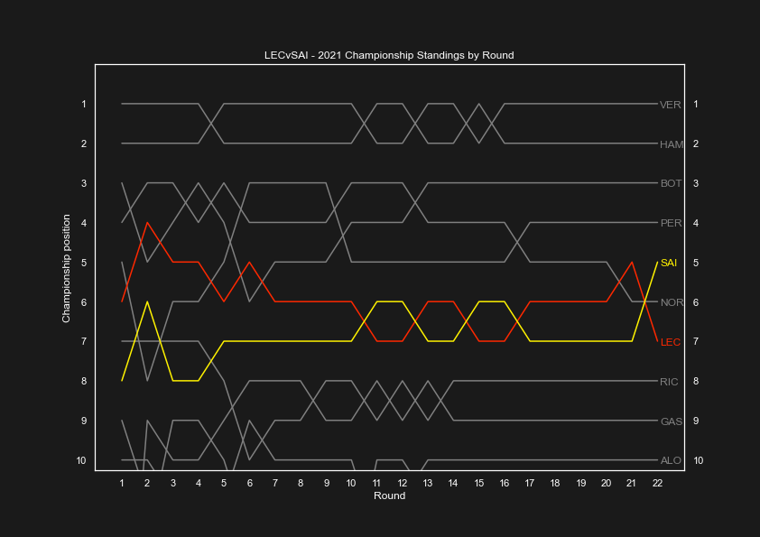

### PROJECTS

  
Here is a recent selection of data and developer projects, as well as a short summary of my Master's thesis in climate modelling.
  

[MScR - Global Environtmental Challenges, University of Bristol](/pdf/bridge_retreat_slides_AL.pdf)
  

  
My Master's thesis was based around climate modelling, specifically paleoclimate modelling (climates of the past) and the Eocene. A hot period of Earth's history roughly 50 million years ago, it's a useful analog for future climates made warmer by anthropromorphic emissions. This time period has been notoriously difficult to model and align with proxy data, partially due to an equable climate where the temperature is fairly linear at all latitudes resulting in a challenge for modellers. My project centred around the HadCM3 global circulation model and whether tuning previous models could get us any closer to the proxy data. I tuned the models and applied changes working in __Linux__ operating systems. I modelled six different levels of CO2 in the Eocene (1x, 2x, 3x, 4x, 6x and 9x) and a pre-industrial control simulation, producing multiple terabytes of data across an array of variables. Most of the models ran for 3000 years of simulation time. I focussed on the temperature data, but others have used my simulations to produce work on the ocean systems at play. I wrote a series of __Python__ scripts and translated a few from R used by previous modellers to analyse and produce some conclusions. My 6xCO2 was the standout, accurately simulating the global surface temperature at the most reasonable level of CO2 hypothesised for the time.
  
The figures above relate to a) the ensemble of models and how mine performed and b) one of the time series plots to track to the progress of each model. I learnt a huge amount in new subjects in a multidisciplinary project, coming from a BSc in Chemistry.

---
[F1 2022 - Ferrari Driver Analysis](https://tripeblog.substack.com/p/f1-2022-carlos-sainz-jr-charles-leclerc)
  

  
An analysis of the results for the Ferrari team during the 2021 season and what it could mean for them going into the 2022 season with arguably the best driver pairing on the grid at the time. Since teams usually opt for a defacto lead driver in the instance of title battle, I laid down the cases for Carlos Sainz Jr. and Charles Leclerc. The former was more consistent and I believe still is the most underrated driver in F1. Ultimately, the 2022 Ferrari was a long way off the pace for this analysis to really matter. I also wrote a short piece analysing telemetry data in the [Bahrain race](https://tripeblog.substack.com/p/f1-2022-leclerc-plays-matador-to) of that year. All analysis scripts, in this project and subsequent, were written in __Python__ as an extracurricular way of learning the language for my Master's research.

---
#### James Ward-Prowse: All Free Kicks Analysed

  
A short project to brighten my mood as a fan of (at the time) struggling Southampton. James Ward-Prowse seems destined to break the premier league free kick record so I wanted to see if I could analyse them from a data perspective to gain insight on his best location and angle. To find his 'territory', as it were. First this involved using some tutorials to write a __web scraping API__ to pull all the shot data for every attempt (including open play) from [Understat](https://understat.com/player/843). The next step was cleaning and stripping the data down to just his free kick attempts and the essentials. Then it was a simple case of plotting the data with __Python__ and it's packages. The findings were enlightening.
 
Grey spots represent attempts that missed the goal. Yellow represents shots that were on target but blocked/saved of marginally off-target hitting the posts. Green spots are goals. The size of each dot relates to the xG of the shot as it was taken. Across 100+ attempts from all areas outside the box, Ward-Prowse scored 17. Most of which came from a remarkably tight area a few yards outside the box and to the left hand side, aiding his technique combining leftward-swing and dip. Remarkably, the total attempts accumulate to 7.31xG (expected goals, a measure of how likely a shot becomes a goal). He outperformed this by nearly 10 goals. 16 of 17 goals used this technique. The only free kick he has scored I've deduced from video analysis that doesn't use this technique is his goal in the 3-1 defeat to Wolves in January 2022. For this goal he basically just channels deep rage and hits a powerful knuckleball from just over 35 yards (xG=0.04!). In laymans terms, [he really whacked it](https://www.youtube.com/watch?v=eQdEplTv0_0).
 
You can find the scripts for this analysis, along with other football related scripts, at this repo [here](https://github.com/andylyfo/joga_bonito).

---
[Batch Cocktail Calculator](https://andylyfo.github.io/batch_cocktail_calculator/)
  

I made a little calculator for batching cocktails to store in the freezer as a companion to an upcoming blog post.
  
---
[Browser Boids](https://andylyfo.github.io/boids/)
  

  
I've always been enamoured by the migratory activity of starlings (who isn't?) known as murmurations, so I set out to make my own version that I can view from my desktop rather than a 4 hour journey down to Brighton beach. Upon the pleasing discovery that this was a well trodden corner of computer science (in particular game design), I built my own simulation with __JavaScipt/HTML/CSS__ to work in a browser window. Sit back and relax. This was adapted from Ben Eater's work, the repo is [here](https://github.com/andylyfo/boids).
  

---

### WRITING

I try to keep my pen sharp by publishing a food-related journal called TRIPE on substack. TRIPE being a synonym for nonsense, naturally.

- [Fooling around with the worlds most expensive spice by weight](https://open.substack.com/pub/tripeblog/p/on-paella-saffron-and-the-pulp-fiction?r=lg3sj&utm_campaign=post&utm_medium=web)
- [Here's a few books I've enjoyed recently](https://open.substack.com/pub/tripeblog/p/heres-a-few-books-i-enjoyed-recently?r=lg3sj&utm_campaign=post&utm_medium=web)
- [On Keith Floyd](https://open.substack.com/pub/tripeblog/p/on-floyd-on?r=lg3sj&utm_campaign=post&utm_medium=web)

